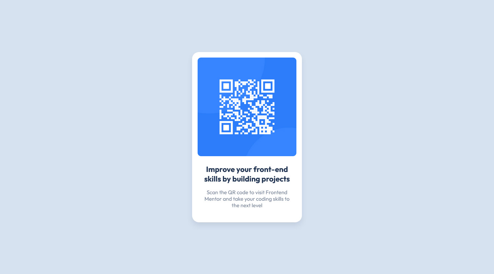

# FrontendMentor-QR-code-component-solution
My solution to the Frontend Mentor - QR code component challenge

This is a solution to the [QR code component challenge on Frontend Mentor](https://www.frontendmentor.io/challenges/qr-code-component-iux_sIO_H). Frontend Mentor challenges help you improve your coding skills by building realistic projects. 

## Table of contents

- [Overview](#overview)
  - [Screenshot](#screenshot)
  - [Links](#links)
- [My process](#my-process)
  - [Built with](#built-with)
  - [Useful resources](#useful-resources)
- [Author](#author)

**Note: Delete this note and update the table of contents based on what sections you keep.**

## Overview

### Screenshot

### Links

- [Solution](https://github.com/rista120/FrontendMentor-QR-code-component-solution/tree/main)
- [Live site preview](https://rista120.github.io/FrontendMentor-QR-code-component-solution/)

## My process

### Built with

- HTML5
- CSS
- Flexbox

### Useful resources

- ADOBE Photoshop - This helped me to get extra informations like paddings and margins ...

## Author

- Frontend Mentor - [@rista120](https://www.frontendmentor.io/profile/rista120)
